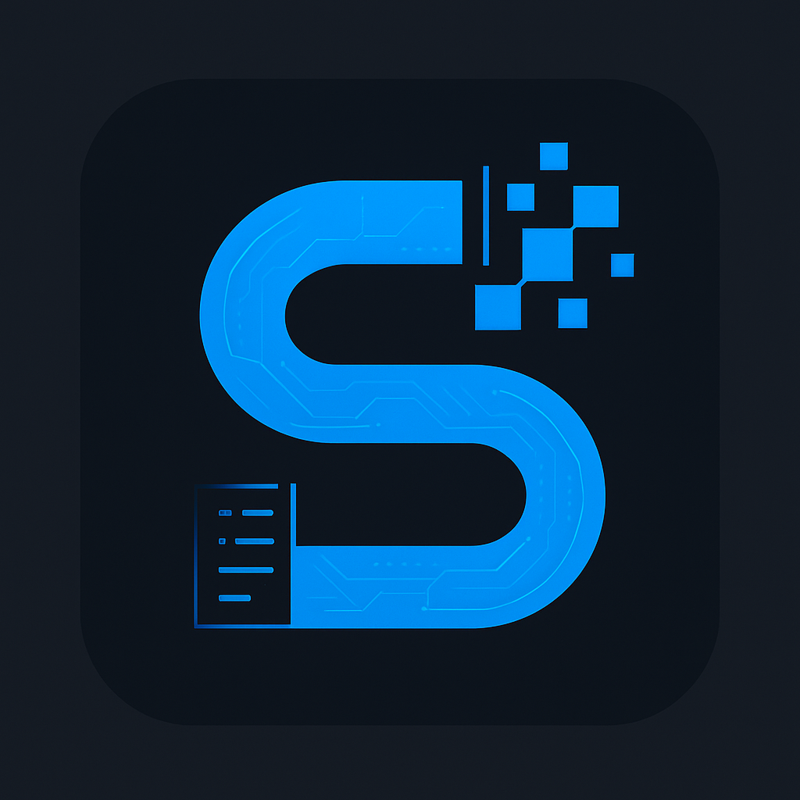
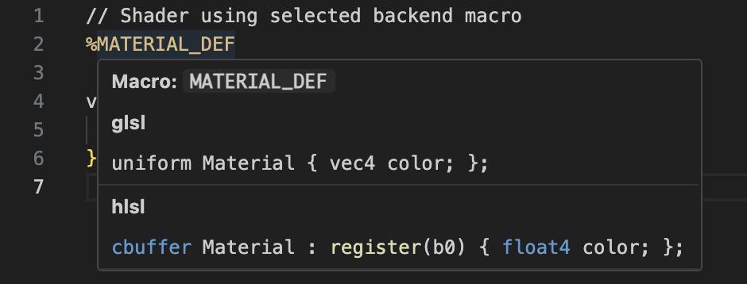
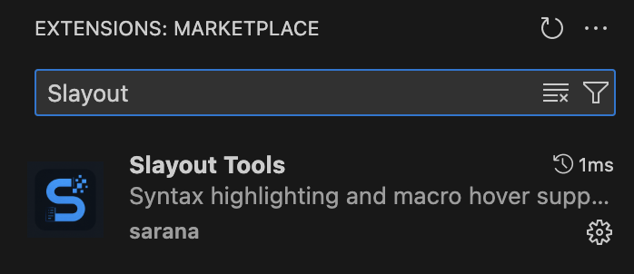

# slayout — Shader Layout DSL and Compiler

`slayout` is a domain-specific language (DSL) and compiler designed to simplify and unify shader layout definitions across multiple shading languages and graphics backends.
It allows you to reuse parts of shader code and define macros to only write one shader instead of one for each format. After defining only one layout and one shader, you can use this CLI tool to generate other shader formats.

## Why we need this?

Writing shaders for multiple backends like **GLSL**, **HLSL**, **MSL**, or **SPIR-V** often requires duplicating layout declarations, adapting syntax, and maintaining parallel versions.

**slayout** solves this by allowing you to define reusable macros and backend-specific layout mappings in a simple scripting language. It replaces layout macros inside your shader files with the appropriate backend-specific code automatically during preprocessing.

It is very useful for renderers that support many backends, such as [Ogre](https://github.com/OGRECave/ogre-next)

## Features

- Define reusable macros using custom layout identifiers.
- Assign backend-specific code for:
  - `GLSL`
  - `HLSL`
  - `MSL`
  - `SPIR-V`
- Fallback to a default layout when backend-specific one is not defined.
- Lazy mode for passthrough macros.
- Boolean variables and conditional execution (`if` statements).
- Print debug information at runtime.
- File includes via `read_*()` functions.
- `string` variable support with automatic concatenation.

## Build Instructions

### Prerequisites

- C++17 or newer compiler (e.g. `clang++`, `g++`)
- [CMake](https://cmake.org/) version 3.15 or higher

### Build Steps

```bash
git clone https://github.com/sssarana/slayout.git
cd slayout
mkdir build && cd build
cmake ..
cmake --build .
```

This will build the CLI tool `slayoutc` inside `build/bin`.

## Usage
Want to learn how to use the language? Check out `USAGE.md` for syntax guide. You can also find examples of typical use cases in `examples/` folder.

## VSCode Extension available!
[Slayout Tools](https://marketplace.visualstudio.com/items?itemName=sssarana.slayout-tools) extension enables syntax highlighting for `.slayout` files and macro highlighting for shaders.
When hovering on the macro, it will display all backend-specific code associated with it, like this:



To find this extension you can search for `Slayout Tools` or follow the link provided above.



Enjoy!